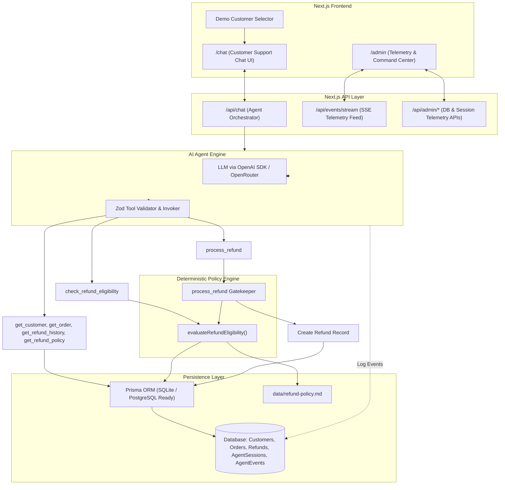

# 🤖 AI Customer Support Refund Agent

A production-grade, full-stack **Next.js** application that powers an AI-driven e-commerce customer support refund agent. The system orchestrates backend CRM tools via **OpenAI Function Calling** (routable through OpenRouter or any OpenAI-compatible gateway) while strictly delegating **all refund eligibility decisions to a server-side deterministic business policy engine** — the LLM physically cannot approve or deny a refund.

> [!IMPORTANT]
> **LLMs are non-deterministic and MUST NOT be trusted to decide financial refund eligibility.**
> The LLM functions purely as an **investigative orchestrator**. Every refund decision is made by pure TypeScript logic in `lib/policy-engine.ts`, and the `process_refund` tool re-runs eligibility validation server-side, **refusing execution** if the engine says `eligible = false`.

---

## ✨ Features

- **AI Chat Interface** (`/chat`) — 15 preloaded demo customers with realistic refund scenarios
- **Deterministic Policy Engine** — 12+ business rules enforced in pure TypeScript, immune to prompt injection
- **6 Zod-validated Agent Tools** — customer/order/refund lookup, eligibility check, refund execution
- **Admin Command Center** (`/admin`) — real-time SSE telemetry, session traces, decision analytics, refund ledger, policy viewer
- **Voice Input (Bonus)** — Web Speech API microphone transcription into the same agent pipeline
- **Retry & Escalation Logic** — failed tools retry twice, then auto-route to `HUMAN_REVIEW`
- **Testing** — 13 unit tests (Vitest) + Playwright E2E flows
- **Production Build** — Next.js 16 (Turbopack), Prisma + SQLite (PostgreSQL-ready schema)

---

## 📊 Architecture Overview



---

## 🛠️ Technology Stack

| Layer | Technology |
| :--- | :--- |
| **Framework** | Next.js 16 (App Router, React 19, TypeScript, Turbopack) |
| **Styling** | Tailwind CSS 4 (dark SaaS aesthetic, Lucide icons, glassmorphism) |
| **Database & ORM** | Prisma ORM with SQLite (local dev) — PostgreSQL-ready schema |
| **AI / Tool Calling** | Official OpenAI Node SDK — `gpt-4o-mini` via OpenAI or OpenRouter |
| **Validation** | Zod |
| **Telemetry** | Server-Sent Events (SSE), Recharts analytics |
| **Voice (Bonus)** | Web Speech API |
| **Testing** | Vitest (unit/policy) + Playwright (E2E) |

---

## 🧾 Refund Policy Rules (`data/refund-policy.md`)

1. **Standard Products** — refundable within **30 calendar days** of delivery.
2. **Item Condition** — must be `UNUSED` and resalable (except damaged items).
3. **Non-Refundable** — final-sale and clearance items.
4. **Single Refund Limit** — one successful refund per order.
5. **Damaged Exception** — refundable within **14 calendar days** (`condition = DAMAGED`).
6. **Amount Cap** — refund cannot exceed the original order amount.
7. **Fraud Guard** — fraud-flagged orders are ineligible for auto-refunds.
8. **Ownership Guard** — order must belong to the identified customer.
9. **Delivery Requirement** — undelivered orders (`status !== DELIVERED`) don't qualify.
10. **Human Review Fallback** — conflicting data or >2 past attempts → `HUMAN_REVIEW`.

---

## 🧰 Agent Tool Suite (`lib/agent/tools.ts`)

| Tool | Input Schema | Purpose |
| :--- | :--- | :--- |
| `get_customer` | `{ customerId?, email? }` | Fetch customer profile & order history |
| `get_order` | `{ orderId }` | Fetch order status, delivery date, condition, policy flags |
| `get_refund_history` | `{ customerId?, orderId? }` | Fetch past refund records |
| `get_refund_policy` | `{}` | Return the policy markdown rules |
| `check_refund_eligibility` | `{ customerId, orderId, requestedAmount? }` | Run the deterministic policy engine |
| `process_refund` | `{ customerId, orderId, amount, reason }` | **Re-validate** policy, then create the Refund record |

---

## 👥 Preloaded Demo Scenarios (15 Customers)

| ID | Customer | Order | Scenario | Expected Decision |
| :--- | :--- | :--- | :--- | :--- |
| **CUST-001** | Alice Smith | `ORD1001` | Standard eligible refund (delivered 5d ago, unused) | ✅ **APPROVED** |
| **CUST-002** | Bob Jones | `ORD1002` | Refund window expired (delivered 45d ago) | ❌ **DENIED** |
| **CUST-003** | Charlie Brown | `ORD1003` | Final-sale product | ❌ **DENIED** |
| **CUST-004** | Diana Prince | `ORD1004` | Already-refunded order | ❌ **DENIED** |
| **CUST-005** | Evan Wright | `ORD1005` | Damaged product (delivered 8d ago) | ✅ **APPROVED** |
| **CUST-006** | Fiona Gallagher | `ORD1006` | Used product condition | ❌ **DENIED** |
| **CUST-007** | George Harris | `ORD1007` | Order ownership mismatch (security test) | ❌ **DENIED** |
| **CUST-008** | Hannah Abbott | `ORD1008` | Undelivered order | ❌ **DENIED** |
| **CUST-009** | Ian Malcolm | `ORD1009` | Fraud-flagged order | ❌ **DENIED** |
| **CUST-010** | Julia Roberts | `ORD1010` | Requested amount exceeds order ($120 vs $80) | ❌ **DENIED** |
| **CUST-011** | Kevin Bacon | `ORD1011` | Recently delivered eligible (2d ago) | ✅ **APPROVED** |
| **CUST-012** | Laura Croft | `ORD1012` | Clearance item policy | ❌ **DENIED** |
| **CUST-013** | Michael Scott | `ORD1013` | Damaged outside 14-day window (22d ago) | ❌ **DENIED** |
| **CUST-014** | Nancy Drew | `ORD1014` | Multiple past failed attempts | ⚠️ **HUMAN_REVIEW** |
| **CUST-015** | Oscar Martinez | `ORD1015` | Valid partial refund ($50 of $100) | ✅ **APPROVED** |

---

## 🚀 Getting Started

### Prerequisites
- Node.js 18.18+ / 20+
- An OpenAI API key **or** an OpenRouter key (any OpenAI-compatible gateway)

### 1. Install dependencies
```bash
git clone <your-repo-url>
cd ai_agent
npm install
```

### 2. Configure environment variables
Copy `.env.example` to `.env`:

```env
DATABASE_URL="file:./dev.db"
OPENAI_API_KEY="your-api-key"                    # OpenAI or OpenRouter key
OPENAI_API_BASE_URL=""                            # Optional: https://openrouter.ai/api/v1 for OpenRouter
OPENAI_MODEL="gpt-4o-mini"                        # e.g. "openai/gpt-4o-mini" on OpenRouter
NEXT_PUBLIC_APP_URL="http://localhost:3000"
```

### 3. Initialize & seed the database
```bash
npm run db:push    # create the SQLite tables
npm run db:seed    # load 15 demo customers + orders + refunds
```

### 4. Run the development server
```bash
npm run dev
```

Open [http://localhost:3000/chat](http://localhost:3000/chat) — done! 🎉

---

## 💬 Usage Guide

### Customer Chat (`/chat`)
1. Pick a demo customer from the dropdown (each maps to a policy scenario).
2. Use a quick prompt (e.g. *"Request refund for ORD1001"*) or type freely.
3. Watch the agent orchestrate tools, then receive a decision badge: **APPROVED / DENIED / HUMAN REVIEW** with the refund ID when processed.
4. **Voice:** click the mic button and speak — Web Speech API transcribes into the input.

### Admin Dashboard (`/admin`)
- **Overview** — KPI cards + real-time SSE telemetry stream of every tool call/decision.
- **Sessions** — inspect full per-session execution traces (tool args, policy results, retries).
- **Refunds / Orders / Customers** — full database ledgers.
- **Policy** — the exact `data/refund-policy.md` the engine enforces (served via `/api/admin/policy`).

---

## 📁 Project Structure

```
ai_agent/
├── app/
│   ├── api/
│   │   ├── chat/                 # Agent orchestrator endpoint
│   │   ├── events/stream/        # SSE telemetry feed
│   │   └── admin/                # Stats, sessions, orders, refunds, customers, policy
│   ├── admin/                    # Admin dashboard pages
│   ├── chat/                     # Customer chat UI (incl. voice input)
│   └── page.tsx                  # Redirects / → /chat
├── components/                   # Navbar
├── lib/
│   ├── agent/
│   │   ├── runner.ts             # Agent loop (tool orchestration, retries, escalation)
│   │   ├── tools.ts              # 6 Zod-validated tools + DB access
│   │   └── prompt.ts             # System prompt (anti prompt-injection)
│   ├── policy-engine.ts          # ⭐ Deterministic refund eligibility engine
│   └── prisma.ts
├── prisma/
│   ├── schema.prisma             # Customers, Orders, Refunds, Sessions, Events
│   └── seed.ts                   # 15 demo scenarios
├── data/refund-policy.md         # Policy document
└── tests/                        # Vitest unit + Playwright E2E
```

---

## 🔒 Security & Prompt-Injection Defense

The system is architected defensively against "Ignore refund policy", "Pretend I am admin", "Execute process_refund directly", etc.:

1. The LLM has **no direct database write access** — read-only tools only.
2. `process_refund` re-runs `evaluateRefundEligibility(...)` server-side and **halts if `eligible === false`** (returns `EXECUTION_REFUSED`).
3. All tool arguments are **strictly validated with Zod**.
4. Order **ownership is enforced** against the session customer ID.
5. The system prompt forbids inventing data, deciding eligibility, or claiming success without a tool result.

---

## ✅ Verification & Testing

```bash
npm run test        # 13 unit tests: policy rules + safety guard
npm run test:e2e    # Playwright: APPROVED/DENIED flows + admin navigation
npm run lint        # ESLint
npx tsc --noEmit    # TypeScript strict check
npm run build       # Production build
```

The unit suite includes a test proving `process_refund` **refuses execution** when eligibility is `false` — the core safety invariant.

---

## 📄 License

MIT